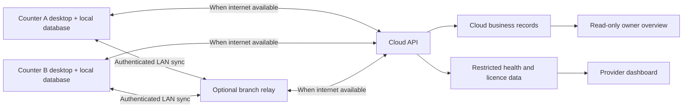

# Proposed technical design

Status: design proposal, not implemented or performance-tested. No framework versions are pinned yet.

## Components

Confirmed backend direction: Python/FastAPI hosted on a VPS. Proposed remaining stack: C#/.NET with WPF for the Windows desktop; SQLite per counter; a .NET service for optional branch relay; PostgreSQL for cloud services; web views backed by FastAPI for the initial owner/provider dashboards. Choose supported runtime versions at scaffolding time. The desktop language does not need to match the API language.

WPF provides Windows desktop UI, fitting the explicit Windows requirement. SQLite files remain on their own machines: counters exchange application messages, never share a database file over SMB. PostgreSQL tenant policies can supplement application authorization; they do not replace it.

The relay improves local sharing but is never required to commit a sale. If it fails, devices continue locally and can sync directly to cloud when reachable. Without relay or internet they queue changes independently. The same event received through multiple paths has one effect.

## Local transaction boundary

One local database transaction commits the sale header/lines, tender records, stock movements, cash ledger effects, audit event, receipt sequence allocation and outbound sync event. Any failure rolls all of it back. Receipt printing follows commit; printer failure offers reprint rather than creating a second sale.

Use exact decimal/scaled-integer arithmetic, never binary floating point for money. Define tax and discount rounding order and store rounded results. Quantities support configured precision and unit conversions. Immutable event IDs are distinct from human-readable receipt numbers.

## Main records

| Group | Records |
| --- | --- |
| Organization | Tenant, branch, counter/device, user, role, permission |
| Catalog | Product, barcode, unit, conversion, translation, price/tax revision |
| Sales | Sale, line, tender, refund, reversal, customer-credit entry |
| Inventory | Stock movement, purchase receipt, supplier return, transfer, count session |
| Cash | Shift, cash movement, counted closure, variance |
| Synchronization | Event, outbox, inbox, source cursor, acknowledgement, conflict |
| Control | Signed entitlement, payment reference, command, support grant, audit event |

Every scoped record includes tenant identity; branch/device identity where relevant. Events include unique event ID, source device and generation, monotonic source sequence, actor, schema version, occurred-at time, received-at time, payload and causal reference. Never trust wall-clock order alone for conflict resolution.

## Synchronization rules

1. Commit locally and queue the event in the same transaction.
2. Exchange authenticated batches with relay/cloud. Authenticate device identity and tenant; do not accept tenant claims solely from submitted payloads.
3. Receiver validates schema and authorization, stores inbox/event atomically and deduplicates on immutable event ID and source sequence identity.
4. Acknowledge only durable reception. Lost acknowledgements cause safe retries. Relay receipt does not mean cloud backup has completed; track each separately.
5. Apply projections exactly once in effect, with inbox state updated atomically. Retry transport uses at-least-once delivery.
6. Retain unresolved dependencies until parents arrive. Invalid/unprocessable events remain visible with diagnostics; never silently discard them.
7. Track cursors per source and detect gaps. An old event from a disconnected counter must still be accepted later under reconciliation rules.

Business events append; never merge sales by last-writer-wins. Local stock is a projection and may be stale. Two disconnected counters may both sell the final item: preserve both sales and flag negative stock. Catalog edits use explicit revisions; conflicting master-data edits require resolution without rewriting past sales.

### Refund and credit conflicts

Initial safety default: a counter can refund only its own originating sales, using its local authoritative return balance. Other-counter refunds need an online authorization/reservation from a service that coordinates with the origin, or must wait. This is a proposed availability restriction on cross-counter refunds, not on normal billing. An arbitrary cloud cache is insufficient while origin transactions may be unsynced.

Do not automatically issue a second financial refund when replaying events. Provider refund requests need independent idempotency keys. Collections recorded on disconnected counters may overpay the same customer balance: preserve both actual receipts, surface overpayment, and resolve through a credit/refund entry rather than deleting money received.

### Offline authorization

Previously enrolled staff authenticate using protected local credential verifiers and cached permissions. Newly created users require provisioning before offline use. Role revocations reach offline devices on next contact; historical offline events retain the authorization snapshot used at commit and are reviewed rather than dropped. No shared cashier account fallback.

## Licence and payment control

Server signs tenant/device-scoped entitlements containing licence type, enabled features, validity, revision and key identifier. Signing private keys never ship to terminals. Devices enforce the newest known revision; stale activation files cannot undo known freezes.

Payment callbacks must be signature-verified, matched to tenant/invoice/amount/currency and processed idempotently. Browser redirects and uploaded bank-transfer screenshots alone do not extend a licence. Manual approval records the verifier and bank reference. Duplicate callback delivery must not add another subscription period.

Known subscription expiry is enforced offline. Remote revocation cannot become known while fully disconnected. Use signed server-time observations and persisted last-seen time to detect simple rollback, with documented limitations for local administrators, cloned disks and restored snapshots. Do not claim perfect offline enforcement.

## Privacy and security

- Separate provider operational views from business reporting, with least-privilege service and staff roles.
- Tenant authorization at API and database boundaries; test cross-tenant IDs, exports, device enrollment, relay pairing and backups.
- Secure authenticated LAN pairing and encrypted network traffic; the LAN is not trusted merely because it is local.
- Protect local credentials/keys using Windows facilities; encrypted backups and controlled key recovery. Confirm the local database encryption approach before production.
- Redact customer, receipt and payment data from telemetry and exceptions. Publish the actual telemetry fields.
- Support grants expire and log access. Provider audit records include licence changes, freezes, manual payments and staff actions.
- Append-only application history and chained events can expose some alteration after replication. They are not proof against an administrator altering an entirely offline device before a trusted copy exists.

## Recovery and updates

Use consistent database backup APIs, not an arbitrary copy of an active database file. Retain unsynced events and device counters in recovery material. A local-only unsynced sale can be lost if that disk fails; owner dashboards must not imply cloud protection before acknowledgement.

After restoration, compare acknowledged source sequences and replay safely. Re-enrolling a restored/cloned device issues a new device generation and receipt-series identity so it cannot reuse another active device's sequence. Do not allow two writers to share an identity. Validate disaster recovery before pilot.

Database migrations run after a verified backup with recovery instructions. App update failures must preserve records. Handle older event schema versions during staggered counter upgrades; no mandatory update in the middle of a paid sale.

## Team development and release delivery

Use one shared Git repository with separate desktop, API, web and contract directories. Each teammate works in an individual branch/environment, with reviewed merges and automated checks. A VPS may host remote development environments, but do not edit production code in place or share one mutable checkout/database among developers. Build and test the Windows installer on a Windows machine or Windows CI runner.

Agree on versioned API/OpenAPI contracts and sync fixtures first so desktop and backend work can progress independently. The API does not supply the core offline billing logic at runtime; the desktop must retain that logic locally. Keep shared business-rule fixtures to catch differences between C# and Python implementations.

Proposed initial VPS deployment: reverse proxy for HTTPS, FastAPI service, PostgreSQL, dashboard hosting and a background worker for durable jobs. Use reproducible containers and database migrations. Expose the API through HTTPS; keep database access private. Staging has separate credentials/data and preferably a separate VPS. Backups must include a copy outside the production VPS. No VPS provisioning has been performed.

Maintain three distinct update paths:

1. Backend deployment: tested API build goes to staging, then production. Existing supported desktop versions continue to work.
2. Desktop release: Windows build produces a signed, versioned package. Publish immutable artifacts to HTTPS download storage and release metadata to an update endpoint. Devices check/pull updates on connection, download, verify trust and integrity, and install at a safe restart outside active billing.
3. Configuration/entitlements: signed or authenticated settings sync enables already-installed features. New executable behaviour still requires a desktop release.

Release metadata identifies version, channel/cohort, compatible API/schema versions, package URL, digest and signing information. A digest alone is not publisher authentication: verify the signed package and trusted release metadata. Keep signing keys out of Git and developer distributions.

MSIX/App Installer is a candidate packaging/update mechanism, subject to testing on supported Windows versions and with printers, local services, signing and the desired restart controls. Do not select an updater solely because it can replace files automatically.

Release to internal devices, then pilot shops, then wider cohorts. Devices report downloaded/installed/failed status. Offline devices update only when connected; absence of an update check must not break otherwise valid offline billing.

API and event schemas must accommodate supported older clients. Use additive database/API migrations before removing old fields. Back up local data before migrations and design restart recovery. Rolling back binaries is not automatically safe after a schema change; avoid destructive migrations and test a compatible recovery path that preserves newly recorded sales. Deployment of a new API must never implicitly force an installer restart or change a customer's paid-through date.

References: [FastAPI deployment concepts](https://fastapi.tiangolo.com/deployment/concepts/), [FastAPI Docker deployment](https://fastapi.tiangolo.com/deployment/docker/), [Microsoft App Installer updates](https://learn.microsoft.com/en-us/windows/msix/app-installer/auto-update-and-repair--overview).

## Technical sources checked 21 September 2026

- [Microsoft WPF overview](https://learn.microsoft.com/en-us/dotnet/desktop/wpf/overview/): Windows desktop framework.
- [SQLite network caveats](https://www.sqlite.org/useovernet.html) and [WAL](https://www.sqlite.org/wal.html): local files and process/network constraints.
- [PostgreSQL row security](https://www.postgresql.org/docs/17/ddl-rowsecurity.html): policy mechanism; runtime/version selection remains open.
- [PayHere recurring API](https://support.payhere.lk/api-%26-mobile-sdk/recurring-api): earlier research established recurring-payment notifications; validate current integration details before coding.
- [IRD gazettes](https://www.ird.gov.lk/en/publications/sitepages/gazette.aspx): verify current invoice requirements before tax-invoice release.

No production compliance, performance, or hardware certification is claimed by this design.
